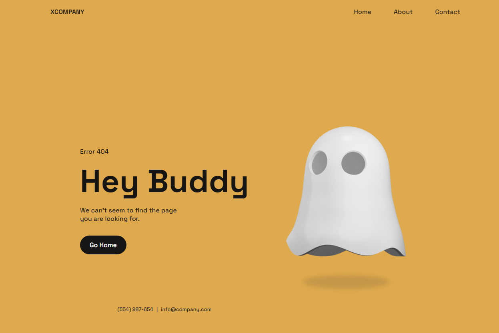

<h1 align="center">
   404 - Page
</h1>
<!--
<h2 align="center">
  Travel to San Francisco Safely
</h2> -->

  

## 💻 Projeto

Esse projeto foi desenvolvido na live do [Bedimcode](youtube.com/c/Bedimcode) .

Dependências usadas no projeto:
-  [Html](https://developer.mozilla.org/pt-BR/docs/Web/HTML)
-  [CSS](https://developer.mozilla.org/pt-BR/docs/Learn/CSS)
-  [JS](https://developer.mozilla.org/en-US/docs/Learn/JavaScript)

## Crédito

-  [Bedimcode](youtube.com/c/Bedimcode)

## 📥 Instalação e execução

Faça um clone desse repositório e acesse o diretório.